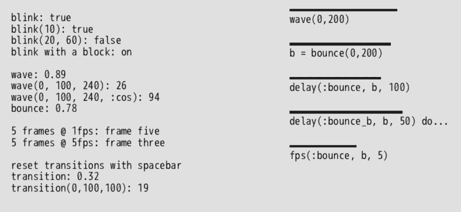

# Ebb



## Time-based helpers for Ruby game dev

Ebb is built with [DragonRuby](https://dragonruby.itch.io/dragonruby-gtk) in mind, and is presented in this repo as a DragonRuby game for now, but should work with other similar game engines.

```ruby
# main.rb

require 'app/lib/ebb.rb'

$e = Ebb.new

def tick(args)
  $e.tick

  # Helpers yield to a block
  $e.blink do |on|
    args.outputs.labels << [10, 10, on ? 'on' : 'off']
  end

  # Or return a value
  args.outputs.labels << [10, 30, $e.blink ? 'on' : 'off']

  # See main.rb in this repo for more examples
end
```

### How to use

- Require `ebb.rb` (copy it into your game, for instance, in lieu of other package management)

- Make an `Ebb` instance. You can do this however you need as long as the instance is shared across frames. The example above sets it as a global outside of the game's `#tick` method, but there are other ways.

- Call `#tick` on the `Ebb` instance once per frame.

- Call helpers like `blink`, `wave`, and `delay`. Each returns a value or yields it to a block.

### Docs

Coming soon

### More

- See [main.rb](app/main.rb) for more examples
